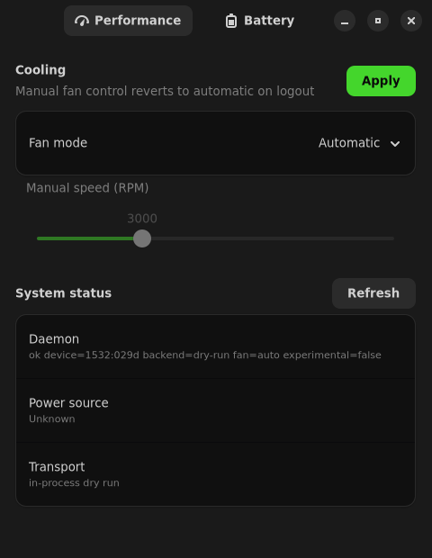
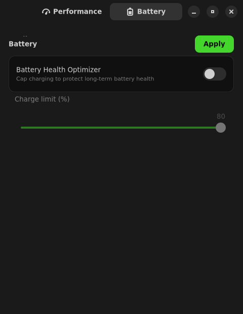

# Razer Control Secureblue

An Atomic-Linux-oriented rebuild of Razer Blade control foundations.

Licensed **GPL-2.0-only**. The HID protocol layer (`src/protocol.rs`) is
derived from [razer-control-revived](https://github.com/encomjp/razer-control-revived)
(GPL-2.0), which in turn builds on the razer-laptop-control lineage, and
cross-checked against the independently derived
[fang-razer-linux](https://github.com/bladeandsoulx/fang-razer-linux)
protocol crate (GPL-2.0). The rest of the code is original to this project.

This initial milestone deliberately does **not** send HID commands to hardware. It establishes the safety boundary required before that work: a verified device capability table, profile validation, a secure runtime-socket location, an udev rule which grants access only to the active local user, and a wire-protocol encoder whose packets are locked down by golden-byte tests but never sent.

## Blade 14 (2023)

The Razer Blade 14 (2023) is recognised as USB `1532:029d`. Its declared capabilities are:

- automatic or 2000–5400 RPM manual fan control (range read from Synapse on
  the tested device; see docs/DEVICES.md);
- Battery Health Optimizer charge limit of 50–80%;
- CPU/GPU boost modes, disabled unless explicitly opted into as experimental.

## Security model

- No kernel module or DKMS component.
- No world-writable `hidraw` node: the supplied udev rule uses `TAG+="uaccess"` only.
- The user daemon socket belongs in `$XDG_RUNTIME_DIR/razer-control/`, never `/tmp`.
- Hardware writes are double-gated: the hidraw backend exists only in builds
  with the `hidraw-backend` cargo feature, and even then the daemon uses it
  only when started with the explicit `--backend hidraw` flag. Every packet
  the encoder can emit is pinned by model-specific golden-byte tests
  ([src/protocol.rs](src/protocol.rs)); on-device verification on the Blade 14
  is the remaining step before the flag is documented as supported.

## Try the current foundation

```bash
cargo test
cargo run -- device 1532 029d
cargo run -- validate bho 80
cargo run -- validate fan manual 3000
cargo run -- udev-rule
```

`boost` and `gpu-tdp` are intentionally rejected unless `--experimental` is supplied. A valid policy decision is not yet a hardware write.

## Daemon (dry-run skeleton)

`razer-control daemon` is a per-user, socket-activated daemon. It validates
every request against the capability table and hands accepted operations to
its backend — by default a **dry-run backend that only logs**. In builds with
the `hidraw-backend` feature, `daemon --backend hidraw` opens the Blade's EC
over hidraw instead (feature reports, single retry on BUSY, response echo
checked); a plugged-in Razer peripheral can never be selected in place of the
laptop. The transport and failsafe behaviour are identical in both modes:

- systemd socket activation on `%t/razer-control/daemon.sock` (0600 socket in
  a 0700 directory); a manual fallback uses `$XDG_RUNTIME_DIR` and refuses to
  start without it — never `/tmp`;
- on SIGTERM/SIGINT the daemon reverts manual fan control to automatic before
  exiting, so a logout or crash of the session can never strand the EC in a
  fixed-RPM state unsupervised.

Test it on a Linux session:

```bash
mkdir -p ~/.config/systemd/user
cp systemd/razer-control.{socket,service} ~/.config/systemd/user/
systemctl --user daemon-reload
systemctl --user enable --now razer-control.socket

razer-control ctl status
razer-control ctl fan manual 3000
razer-control ctl fan auto
```

## Control GUI

| Performance | Battery |
| --- | --- |
|  |  |

*Screenshots from the dry-run build (`RAZER_CONTROL_MOCK=1`); no hardware
commands are sent.*

`razer-control-desktop` (in [desktop/](desktop/)) is a native
GTK4/libadwaita app and a pure IPC client: every control sends one line of
the daemon protocol, and all safety decisions stay in the daemon. It uses
GTK4 rather than a webview because WebKitGTK — which Tauri mandates on Linux
— sits badly on Secureblue's hardened runtime (its bwrap web-process sandbox
breaks on atomic/hardened layouts and collides with hardened_malloc); the
GUI that already works there, razer-control-revived, is GTK4/libadwaita too.

GTK4/libadwaita are Linux-only, so the crate builds the real UI only on
Linux and is a stub elsewhere — core and daemon work still develop on
Windows, but the GUI runs on the Linux/Secureblue side. It talks to the real
per-user socket by default; `RAZER_CONTROL_MOCK=1` swaps the transport for an
in-process copy of the identical daemon core with the dry-run backend:

```bash
RAZER_CONTROL_MOCK=1 cargo run -p razer-control-desktop
```

The app holds no policy. Beyond forwarding IPC lines it reads the power
source for display only; privileged desktop integration (refresh-rate
switching, KDE settings) remains a tracked follow-up.

`razer-control-tray` is a StatusNotifierItem tray for KDE Plasma (ksni): a
third thin client whose menu actions each send one IPC line — fan auto, a
manual preset, charge limit, and launching the desktop app. Start it from the
application menu or add it to Plasma autostart.

## Installation

See [docs/INSTALL.md](docs/INSTALL.md) for the Atomic/Secureblue paths:
release RPM via `rpm-ostree install`, a BlueBuild custom-image snippet, and
the planned COPR repository. Tagged releases ship RPMs with SHA256 checksums
built by CI.

## Atomic/Secureblue packaging direction

This project will ship a signed RPM and an OCI/custom-image recipe. A host service is necessary because the laptop controller is a local HID device; a Flatpak alone cannot safely provide this feature.

The planned tiers: a COPR-built signed RPM as the source of truth, a
documented `rpm-ostree install` layering path, and a BlueBuild/custom-image
module so image-based users never layer at all. CI builds the RPM in a Fedora
container ([packaging/razer-control-secureblue.spec](packaging/razer-control-secureblue.spec)),
installs it, and asserts that the udev rule and user units land in the right
paths with no world-writable device access.

Secureblue note: the Blade's EC is an internal USB HID device present at
boot, so a USBGuard policy generated on the machine covers it. If you have
tightened your USBGuard policy by hand, allow `1532:029d` explicitly.
